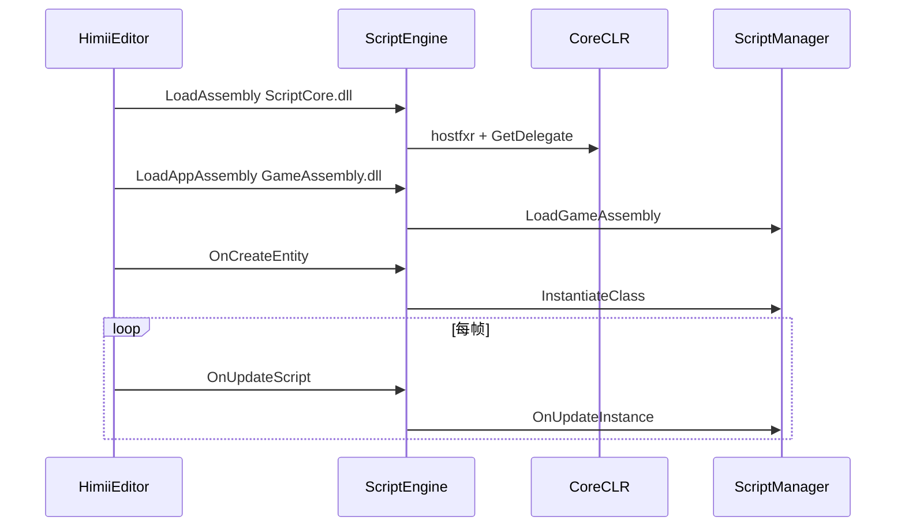
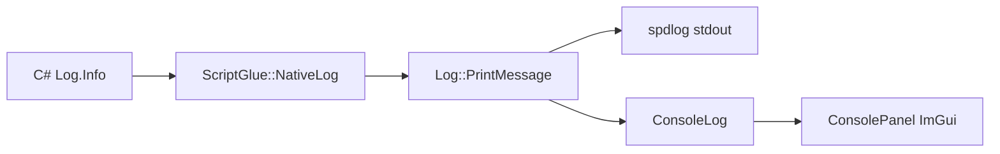

# 技术总览（引擎与编辑器）

本文档描述 Himii-Engine 当前的技术栈、仓库结构、核心子系统与典型数据流，供贡献者快速上手。

---

## 1) 技术栈

| 类别 | 选型 |
|------|------|
| 语言 / 构建 | C++17、CMake、vcpkg 清单模式 |
| 渲染 | OpenGL（GLAD）、GLM |
| 窗口 / 输入 | GLFW |
| UI | Dear ImGui（Docking）、ImGuizmo |
| 物理 2D | Box2D v3 |
| 脚本 | .NET 8、CoreCLR、`hostfxr`、可收集 ALC |
| 序列化 | yaml-cpp |
| 日志 | spdlog + 编辑器 `ConsoleLog` 缓冲 |

---

## 2) 仓库结构

```
Himii-Engine/
├── Engine/           # 静态库：Core、Renderer、Scene、Scripting、Physics…
├── HimiiEditor/      # 编辑器可执行程序（Layer：EditorLayer + 各 Panel）
├── HimiiRuntime/     # 无 UI 的运行时启动器
├── ScriptCore/       # C# 脚本宿主 API（Entity、Input、Log、InternalCalls）
├── Tools/            # 构建期工具（ResourcePacker → engine.hpck）
├── cmake/            # Post-build 脚本（Editor / Runtime 输出目录 staging）
├── Docs/docs/        # 用户 / 开发者文档
├── HimiiEditor/assets/           # 编辑器附带资源（Debug 松散文件 / 打包输入）
└── build/            # CMake 生成目录（x64-debug 等）
```

> **说明**：早期示例工程 **TemplateProject**（CubeLayer 体素地形等）已不再作为默认产品入口；当前以 **HimiiEditor** 为主开发界面。

---

## 3) 模块划分

### Core

- `Application` / `LayerStack`：主循环、层生命周期
- `Window` / `Input` / `Events`
- `Log`：`Print`（带源码位置）、`PrintMessage`（脚本/分类消息）
- `ConsoleLog`：线程安全环形缓冲，供编辑器 Console 面板读取

### Renderer

- 抽象：`Renderer2D`、`Shader`、`Texture`、`Framebuffer`
- 平台：`Platform/OpenGL` 实现
- 编辑器视口：场景渲染到 FBO，ImGui `Image` 显示

### Scene（ECS）

- `entt::registry` + `Entity` 句柄
- 组件：`Transform`、`SpriteRenderer`、`Camera`、`ScriptComponent`、2D 物理组件等
- `SceneSerializer`：`.himii` 场景 YAML 读写
- `OnRuntimeStart` / `OnSimulationStart`：脚本实例化、Box2D 世界创建

### Scripting

- **C++**：`ScriptEngine`（CoreCLR 宿主、实例表、`OnUpdate` / 碰撞分发）
- **C++**：`ScriptGlue`（`NativeLog`、`Transform`、Input、Physics2D 等 native 函数表）
- **C++**：`ScriptCompiler`（异步 `dotnet build`）、`ScriptIDELauncher`
- **C#**：`ScriptManager`（加载 `GameAssembly`、实例生命周期）
- **C#**：`ReflectionBridge`（Inspector 字段读写）
- **C#**：`InternalCalls` + `NativeFunctionsMap` 互操作

### HimiiEditor

- `EditorLayer`：DockSpace、Play/Simulate/Stop、项目与场景 IO
- 面板：Hierarchy、Content Browser、Console、Script Console、Preferences 等

---

## 4) 应用生命周期

1. `Log::Init`、窗口与 OpenGL、ImGui 初始化
2. 压入 `EditorLayer`（及可选其他 Layer）
3. 主循环：事件 → `OnUpdate` → ImGui → 呈现
4. 退出时释放层与 CoreCLR 脚本实例

**Play 模式**（`EditorLayer::StartScenePlay`）：

1. `ConsoleLog::Clear`
2. 复制 `EditorScene` → `ActiveScene`
3. `Scene::OnRuntimeStart` → `ScriptEngine::OnRuntimeStart` → 各实体 `OnCreateEntity`
4. 每帧：`OnUpdateRuntime`（脚本 `OnUpdate`、Box2D Step、接触事件 → `OnCollisionEnter2D/Exit2D`）

**Simulate**：仅 `OnPhysics2DStart` + 物理步进，不实例化游戏脚本。

---

## 5) 脚本加载与调用链



`ScriptGlue::GetNativeFunctions()` 填充 `ScriptEngineData`，经 `InternalCalls.Initialize` 绑定到 C# 委托（含 `NativeLog(level, msg)`）。

---

## 6) 日志数据流



引擎内部 `HIMII_*` 宏走 `Log::Print`，也会写入 `ConsoleLog`（source=`Engine`）；Console 面板默认仅显示 `Script`，可勾选 **Show Engine Logs**。

---

## 7) 渲染帧（编辑器视口）

1. 根据视口尺寸 Resize 场景 FBO
2. `Renderer2D::BeginScene(camera)` 绘制精灵、UI 等
3. `EndScene`，将颜色附件交给 ImGui 显示
4. Edit 模式下 ImGuizmo 操作选中实体 Transform

（3D 网格、天空盒等能力因项目/scene 内容而异，2D 批处理为主路径。）

---

## 8) 构建与运行

见 [源码构建](BuildingFromSource.md)。典型输出：

- `build/x64-debug/bin/HimiiEditor/Debug/HimiiEditor.exe`

---

## 9) OpenGL / GLM / ImGui 速查

### OpenGL

- 透视：`glm::perspective(fovyRad, aspect, near, far)`
- 深度：常规 `GL_LESS`；天空盒可用 `GL_LEQUAL` + 关闭深度写
- FBO：颜色纹理 + 深度 RBO；Resize 时重建附件

### GLM

- `glm::lookAt`、`glm::radians` / `degrees`
- `#include <glm/gtc/matrix_transform.hpp>`

### ImGui

- Docking 布局；`ImGui::Image` 显示 FBO 时 UV 常为 `(0,1)-(1,0)` 翻转
- 面板尺寸用 `GetContentRegionAvail()` 回传渲染层

---

## 10) 延伸阅读

- [场景序列化](CoreSystems/Serialization.md)
- [开发路线图](../Roadmap.md)
- [用户手册：脚本 API](../UserManual/ScriptingAPI.md)

---

> **历史说明**：仓库早期曾含 TemplateProject / CubeLayer 等 3D 地形演示，已移除。当前默认流程以 `HimiiEditor` + `Engine` + `ScriptCore` 为准。
