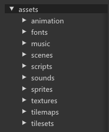
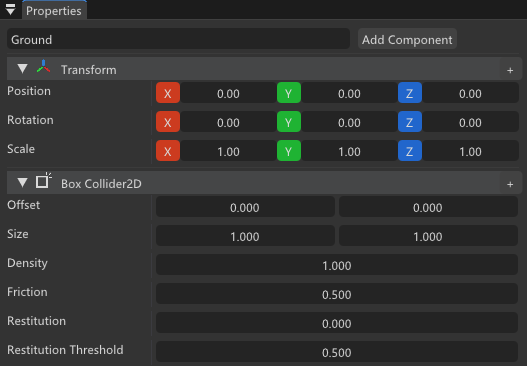

# 教程：制作可运行的 2D 平台跳跃

本教程从零开始，在 HimiiEditor 中完成一个 **可左右移动、跳跃、切换逐帧动画** 的 2D 平台角色，并在编辑器内 **Play** 运行。

完成后的效果：

- **A / D**（或方向键）水平移动  
- **Space** 跳跃  
- 站立 / 跑步 / 空中播放不同动画  
- 角色朝向随移动方向翻转  

预计用时约 **30～60 分钟**（视素材准备情况而定）。

---

## 开始之前

### 你需要准备

| 项目 | 说明 |
|------|------|
| 已构建的 HimiiEditor | 见 [快速开始](GettingStarted.md) |
| 新项目或空白场景 | **File → New Project** 或打开已有 `.hproj` |
| 角色图集 PNG | 已按固定格子切好（如每格 32×32），含站立、跑步、空中等帧 |
| （可选）地面贴图 | 本教程先用 **静态碰撞体** 做地面，无需 Tilemap |

建议目录结构：

```
<你的项目>/
├── assets/
│   ├── textures/       # 角色图集、地面图（可选）
│   ├── animation/      # 将保存 Player.anim
│   ├── scripts/        # PlayerController.cs
│   └── scenes/         # 主场景 .himii
```

> ****   
> 内容浏览器中 `assets` 下 textures、animation、scripts、scenes 文件夹。

---

## 第一步：创建场景与地面

1. 在 **Content Browser** 打开 `assets/scenes`，双击打开主场景（或 **File → New Scene** 后保存为 `Main.himii`）。
2. 在 **Scene Hierarchy** 右键 → 创建实体，命名为 `Ground`。
3. 为 `Ground` 添加组件：
   - **Transform**：放在世界下方，例如 Position `(0, -2, 0)`，Scale 按需要拉宽，如 `(20, 1, 1)`。
   - **Sprite Renderer**（可选）：拖入地面纹理，仅用于可视化。
   - **Box Collider 2D**：**Size** 与地面对齐；无需 **Rigidbody 2D**（静止碰撞体在 Play 时会作为 Static 参与物理）。

> **** 
> Hierarchy 中 Ground 实体，Inspector 显示 Box Collider 2D。

---

## 第二步：制作角色动画资产

1. 将角色图集 PNG 放入 `assets/textures/`（内容浏览器会自动显示）。
2. 菜单 **Window → Animation Editor**。
3. 将图集 **拖入** Animation Editor 的图集区域，设置 **Cell Size (px)** 与美术导出一致（例如 `32`）。
4. 在左侧 **Animations** 中：
   - **Add** → 命名为 `Idle`，在 **Atlas Picker** 上按顺序点击站立帧。
   - **Add** → 命名为 `Run`，点选跑步帧序列。
   - **Add** → 命名为 `Jump`（或 `Roll`），点选空中帧。
5. 每条动画设置 **FPS**、**Loop Mode**（站立/跑步用 **Loop**，空中可用 **Once** 或 **Loop**）。
6. **File → Save Animation As**，保存到 `assets/animation/Player.anim`。

详细编辑器说明见 [2D 逐帧动画](SpriteAnimation.md)。
 
> 已完成 Idle、Run、Jump 三条动画。

**检查点**：保存后重新打开 `Player.anim`，三条动画名称与帧序列正确。

---

## 第三步：创建玩家实体

1. **Scene Hierarchy** 右键 → 创建实体 `Player`。
2. **Transform**：放在 `Ground` 上方，例如 `(0, 0, 0)`；**Scale 保持 `(1, 1, 1)`**。
3. 依次 **Add Component**：

| 组件 | 设置 |
|------|------|
| **Sprite Renderer** | 可先留空；有 Sprite Animation 时由动画驱动显示 |
| **Sprite Animation** | **Animation** → `Player.anim`；**Current Animation** → `Idle`；勾选 **Playing** |
| **Rigidbody 2D** | **Body Type** → **Dynamic**；勾选 **Fixed Rotation** |
| **Box Collider 2D** | 调整 **Offset** / **Size** 贴合角色身体 |
| **Script** | **Class Name** 填 `PlayerController`（下一步创建脚本后生效） |
  
> Player 实体完整组件列表。

---

## 第四步：编写 PlayerController 脚本

1. **Content Browser** → `assets/scripts` 右键 → **Create → C# Script**，命名 `PlayerController.cs`。
2. 用 IDE 打开项目（**File → Open C# Project**），写入以下代码（可按项目调整键位与数值）：

```csharp
using HimiiEngine;

public class PlayerController : Entity
{
    [SerializeField] private float moveSpeed = 4.0f;
    [SerializeField] private float jumpSpeed = 7.0f;

    [SerializeField] private string idleAnimationName = "Idle";
    [SerializeField] private string runAnimationName = "Run";
    [SerializeField] private string airAnimationName = "Jump";

    private Rigidbody2D _rigidbody;
    private SpriteAnimation _spriteAnimation;
    private SpriteRenderer _spriteRenderer;
    private int _groundContactCount;

    public override void OnCreate()
    {
        _rigidbody = GetComponent<Rigidbody2D>();
        _spriteAnimation = GetComponent<SpriteAnimation>();
        _spriteRenderer = GetComponent<SpriteRenderer>();
        _spriteAnimation?.Play(idleAnimationName);
    }

    public override void OnUpdate(float timestep)
    {
        if (_rigidbody == null)
            return;

        float horizontal = 0.0f;
        if (Input.IsKeyDown(KeyCode.A) || Input.IsKeyDown(KeyCode.Left))
            horizontal -= 1.0f;
        if (Input.IsKeyDown(KeyCode.D) || Input.IsKeyDown(KeyCode.Right))
            horizontal += 1.0f;

        Vector2 velocity = _rigidbody.Velocity;
        velocity.X = horizontal * moveSpeed;

        if (Input.IsKeyDown(KeyCode.Space) && IsGrounded())
            velocity.Y = jumpSpeed;

        _rigidbody.Velocity = velocity;

        UpdateFacing(horizontal);
        UpdateAnimation(horizontal);
    }

    public override void OnCollisionEnter2D(Collision2DInfo collision)
    {
        _groundContactCount++;
    }

    public override void OnCollisionExit2D(Collision2DInfo collision)
    {
        _groundContactCount = System.Math.Max(0, _groundContactCount - 1);
    }

    private bool IsGrounded() => _groundContactCount > 0;

    private void UpdateFacing(float horizontal)
    {
        if (_spriteRenderer == null || System.Math.Abs(horizontal) < 0.01f)
            return;
        _spriteRenderer.FlipHorizontal = horizontal < 0.0f;
    }

    private void UpdateAnimation(float horizontal)
    {
        if (_spriteAnimation == null)
            return;

        if (!IsGrounded())
            _spriteAnimation.Play(airAnimationName);
        else if (System.Math.Abs(horizontal) > 0.01f)
            _spriteAnimation.Play(runAnimationName);
        else
            _spriteAnimation.Play(idleAnimationName);
    }
}
```

3. 保存脚本，在 **Script Console** 确认编译成功（无红色 error）。

脚本 API 说明见 [脚本 API](ScriptingAPI.md)。
  
> 选中 Player 后 Script 组件显示 SerializeField 字段。

---

## 第五步：绑定脚本并保存

1. 选中 `Player`，在 **Script** 组件确认 **Class Name** 为 `PlayerController`（与 C# 类名一致，区分大小写）。
2. 在 Inspector 中调整 **moveSpeed**、**jumpSpeed**、动画名字符串（须与 `.anim` 内 **Name** 完全一致）。
3. **Ctrl+S** 保存工程与场景。

---

## 第六步：运行与验证

1. 点击视口工具栏 **Play**（绿色三角）。
2. 操作：**A / D** 移动，**Space** 跳跃。
3. 观察：角色是否站在地面、能否跳跃、动画是否随状态切换、朝向是否正确。
  
> Play 模式下角色在场景中。

4. 点击 **Stop** 返回编辑。

**教程完成。** 可继续阅读 [编辑器与功能](EditorFeatures.md) 扩展 Tilemap 地面、粒子等。

---

## 常见问题

| 现象 | 处理 |
|------|------|
| 角色下落穿地 | 确认 `Ground` 有 **Box Collider 2D**；Player 为 **Dynamic** + 碰撞体 |
| 无法跳跃 | 碰撞回调未触发：双方需有碰撞体；见 [2D 物理](Physics2D.md) |
| 看不见角色 | 添加 **Sprite Renderer**；**Sprite Animation** 引用正确 `.anim` 且有帧 |
| 动画不切换 | `Play("名称")` 与 `.anim` 内 **Name** 大小写一致 |
| 翻转后消失 | 使用 **Flip Horizontal**，勿将 **Scale.x** 设为负数 |
| Inspector 无脚本字段 | `using HimiiEngine;`；类名与 Script 组件一致；重启编辑器 |
| Script Console 编译失败 | 点击 error 行跳转 IDE 修复语法错误 |

---

## 下一步

- [编辑器与功能](EditorFeatures.md)：各面板与专项编辑器总览  
- [2D 逐帧动画](SpriteAnimation.md)：Animation Editor 深入说明  
- [2D 物理](Physics2D.md)：刚体、Tilemap 碰撞  
- [脚本 API](ScriptingAPI.md)：完整 API 参考  
